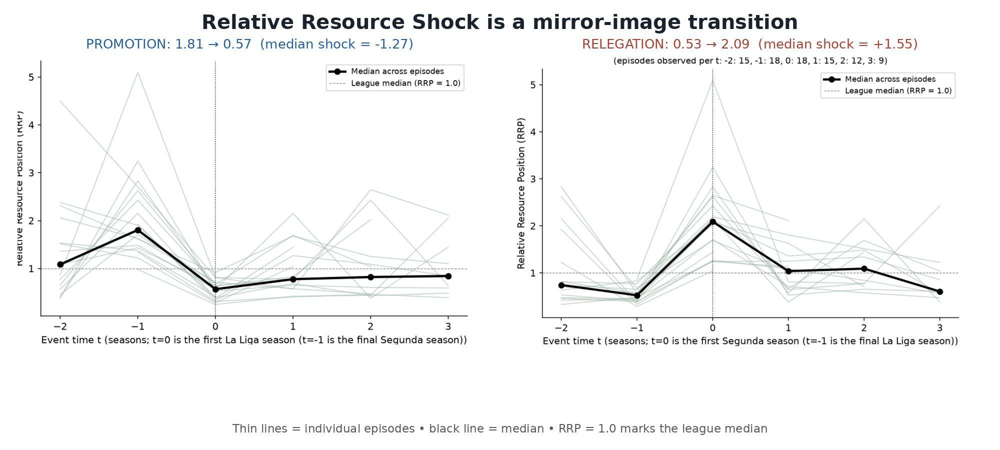
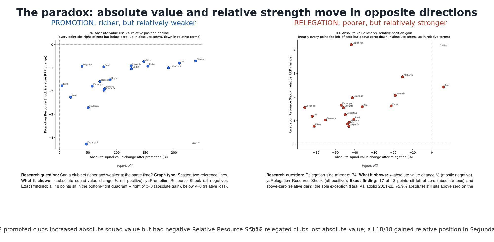

# Going Up, Coming Down

## The Resource Shock of Promotion and Relegation in Spanish Football

> **Publication status: blocked pending data-licence and final-authorship confirmation.** The code,
> aggregate results, approved figures, and manuscript are prepared locally. Row-level SoccerSolver
> data are excluded because redistribution authorization has not been established. The complete
> author list must also be finalized before publication. See `PUBLIC_RELEASE_AUDIT.md`.

## Research Question

What happens to a club's resource position when it crosses between La Liga and Segunda? Is its
relative resource position associated with subsequent survival in La Liga or return after
relegation?

In football terms, promotion can make a club richer than it was in Segunda while leaving it much
poorer than the teams it now faces. Relegation can create the opposite pattern.

## Dataset

The study covers La Liga and Segunda in Spain from 2019-20 through 2025-26. The validated panel
contains **454 club-seasons**, producing **18 promotion episodes** and **18 relegation episodes**.
Outcomes unresolved at the end of the observation window are right-censored rather than treated as
known failures or returns.

The source was a SoccerSolver league-dashboard export containing final standings and squad market
values. The row-level export is not included because redistribution authorization has not been
established. Researchers need independently authorized access for end-to-end recomputation. See
`data/README.md`.

## Relative Resource Position

Relative Resource Position (RRP) compares a club's squad market value with its current league:

```text
RRP = club squad market value / median squad market value of that division-season
```

- **RRP = 1.0:** league median.
- **RRP > 1.0:** above the league median.
- **RRP < 1.0:** below the league median.

The **Relative Resource Shock** is the change in RRP when a club crosses the La Liga-Segunda
boundary. It captures the change in competitive resource position, not an accounting profit,
revenue change, or causal treatment effect.

## Main Findings

All results are descriptive and exploratory associations.

### Promotion

- Median RRP fell from **1.81 in Segunda to 0.57 in La Liga**.
- The median Relative Resource Shock was **-1.27**.
- All **18/18** promoted clubs increased their absolute squad value.
- Median absolute squad-value uplift was **78.4%**.
- Despite that investment, all 18 became weaker relative to their new competitive environment.

The observation that 18/18 entered La Liga below its median is retained as supporting context. It
is strongly structurally expected when promoted clubs enter a substantially richer league and is
not presented as a surprising headline discovery.

### Relegation

- Median RRP rose from **0.53 in La Liga to 2.09 in Segunda**.
- The median Relative Resource Shock was **+1.55**.
- **17/18** relegated clubs lost absolute squad value while becoming stronger relative to Segunda.

### Survival after promotion

- Immediately relegated clubs (n=5) increased squad value by a median **39.4%**.
- Clubs surviving at least two seasons (n=10) increased it by **107.1%**.
- Rank-biserial **r=0.76**; exploratory **p=0.019**.

### Return after relegation

- Clubs returning within two seasons (n=7) entered Segunda at median RRP **2.62**.
- Clubs not yet returned (n=8) entered at median RRP **1.36**.
- Rank-biserial **r=-0.82**; exploratory **p=0.006**.

Higher entry RRP was strongly associated with faster return, but it is not a causal estimate. Squad
market value may proxy for broader sporting and organizational advantages that are not observed in
the available data.

## Figures

These are the only two approved figures. They were extracted directly from the preserved historical
paper and are locked against redesign, regeneration, substitution, cropping, recoloring, or
relabelling.





## Interpretation

A promoted club can become substantially richer in absolute terms while becoming poorer relative
to its new opponents. A relegated club can lose absolute value while becoming relatively stronger
in Segunda. RRP describes this change in competitive context.

The findings do not show that a higher RRP causes survival or rapid return. Resource position may
also reflect academy quality, management continuity, ownership stability, recruitment quality,
wages, revenue, parachute payments, player retention, and wider organizational capacity.

## Reproduction

### Code inspection

The repository includes portable source code for dashboard extraction, club-name normalization,
club-season construction, RRP calculation, episode construction, survival analysis, outcome
comparisons, robustness checks, and aggregate tables. Executable paths are repository-relative or
supplied by the user.

### Aggregate result verification

The safe aggregate tables under `results/tables/` record the headline values used in the paper.
They can be inspected without access to restricted row-level data. Run:

```bash
python scripts/verify_release.py
```

This verifies the locked figure hashes, required release files, safe aggregate headline values,
and absence of symlinks.

### Conditional end-to-end reproduction

Python 3.11 or later is recommended.

```bash
python -m venv .venv
source .venv/bin/activate
python -m pip install -r requirements.txt
```

After independently obtaining an authorized dashboard export, keep it outside the repository and
run:

```bash
python -m src.ingestion.extract_dashboard_data /path/to/authorized-dashboard.html
python -m src.features.build_club_seasons
python -m src.features.build_relative_market_value
python -m src.features.build_episodes
python -m src.features.build_analysis_datasets
python -m src.analysis.main_results_table
python scripts/build_revised_sloan_paper.py
```

This is **conditional**, not full public reproducibility. The two approved paper figures are
preserved assets and are not regenerated by the public workflow.

## Repository Contents

- `paper/`: one current editable DOCX and one current rendered PDF.
- `src/`: portable preparation, analysis, robustness, and validation code.
- `results/tables/`: safe aggregate result tables.
- `results/figures/`: exactly the two locked approved figures.
- `data/README.md`: data-access, schema, and redistribution information.
- `docs/RUBEN_COMMENT_AUDIT.md`: reviewer concerns, evidence, and approved resolutions.

## Limitations

- The study contains only 18 promotion and 18 relegation episodes.
- Unresolved outcomes are right-censored.
- Squad market value is a resource proxy, not wages, revenue, or cash investment.
- The data do not control for academy quality, coaching or sporting-director continuity, ownership
  stability, recruitment quality, wages, revenue, parachute payments, player retention, or broader
  organizational quality.
- The observational design does not identify causal effects.
- The source valuation methodology and snapshot timing are not independently documented.
- The study is specific to Spain.
- The added multi-country `PromotionRelegation.html` dashboard was audited only as an overlap and
  provenance check. It was not incorporated, and its fitted models are not independent validation.

---

## Researcher

<p align="left">
  
</p>

### Rupayan Halder

**PhD Student**<br>
Jadavpur University, Kolkata

**Football AI Researcher**

**Assistant Professor**<br>
University of Engineering & Management (UEM), Kolkata

**Research Collaborator**<br>
SoccerSolver

**Former Software Engineer — Platform Engineering**<br>
Session AI

Rupayan's research interests focus on applying artificial intelligence, machine learning, data
analytics, and computational methods to real-world problems in football, including player
performance analysis, recruitment, transfer-market decision-making, and sporting strategy.

### Connect

[GitHub](https://github.com/RupayanHalder39) ·
[LinkedIn](https://www.linkedin.com/in/rupayan-halder-962922209/) ·
[Email](mailto:rupayanhalder313239@gmail.com)

---

## Research Collaboration

<p align="left">
  
</p>

**This research was developed in collaboration with SoccerSolver.**

---

## Citation

Rupayan Halder is a confirmed researcher/author of this project. The complete author list is still
being finalized; no claim of sole authorship is made. `CITATION.cff` is explicitly provisional and
must be updated before publication.

## Licence

The repository software is provided under the MIT License. This does not grant rights to the
underlying SoccerSolver data or other provider content. The manuscript, approved figures, and
research text remain subject to final author and publication decisions. See `LICENSE` and
`PUBLIC_RELEASE_AUDIT.md`.
